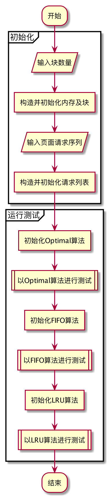
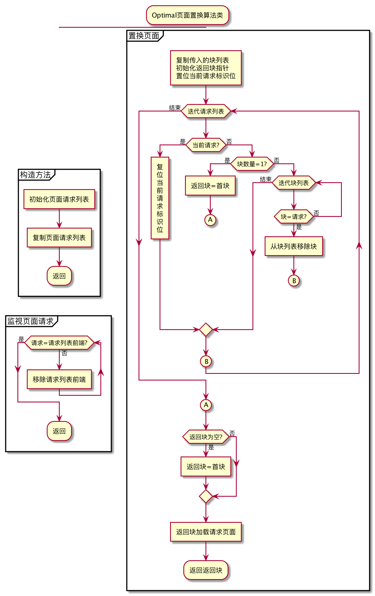
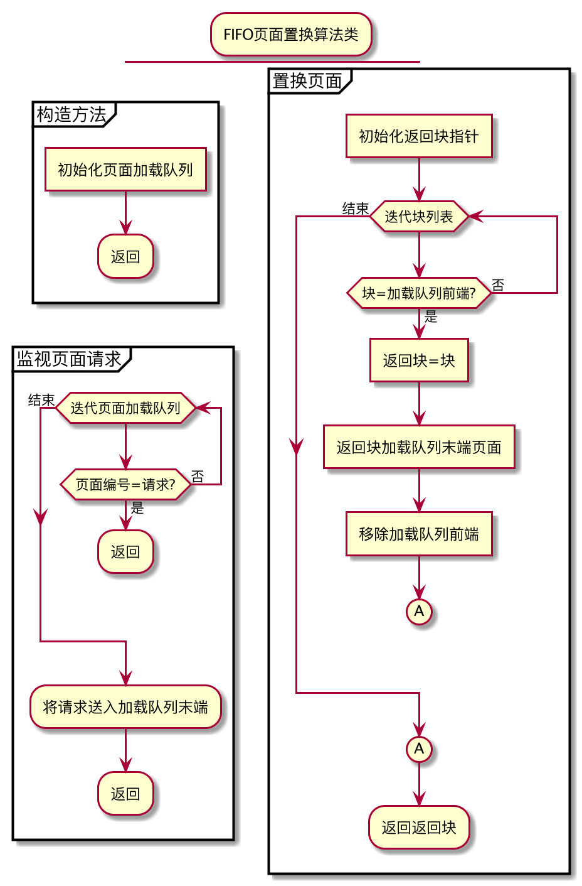
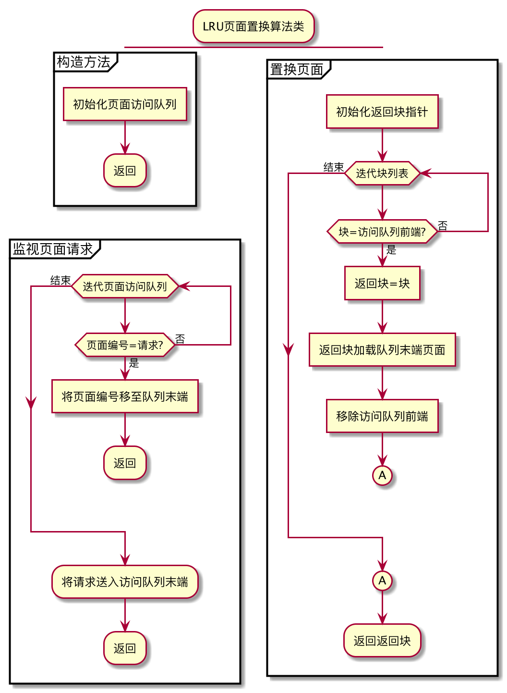
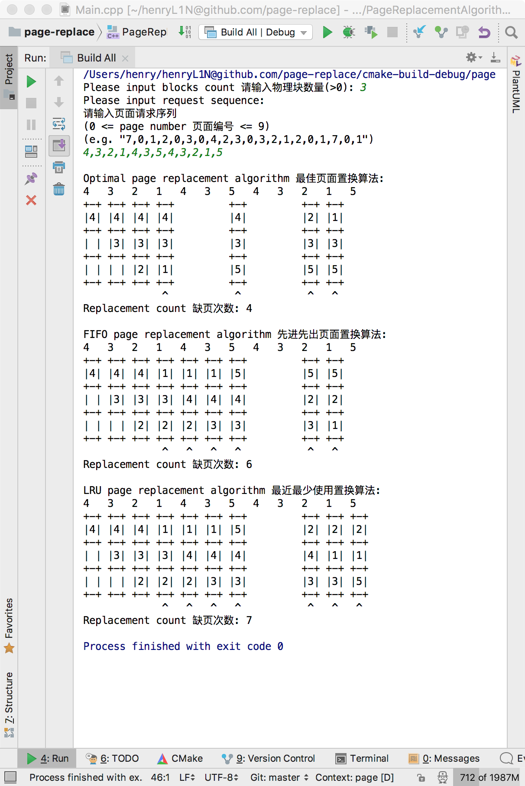
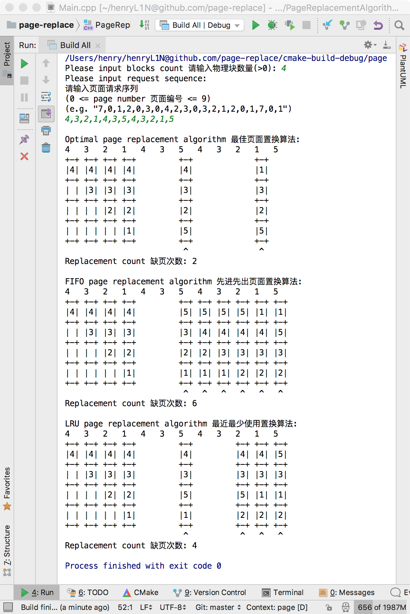

# 页面置换算法模拟实验

学生姓名：林庆华

学号：201707352013001

年级：2017春

专业：计算机科学与技术

层次：大专起点本科

## 实验背景

内存通常容量有限，但有的作业很大，其所要求的内存空间超过了内存总容量，作业不能全部被装入内存，致使该作业无法运行；或者，有大量作业要求运行，但由于内存容量不足以容纳所有这些作业，只能将少数作业装入内存让它们先运行，而将其它大量的作业留在外存上等待。

出现上述两种情况的原因，都是由于内存容量不够大。一个显而易见的解决方法，是从物理上增加内存容量，但这往往会受到机器自身的限制，而且无疑要增加系统成本，因此这种方法是受到一定限制的。另一种方法是从逻辑上扩充内存容量，这正是虚拟存储技术所要解决的主要问题。

虚拟存储器的实现主要包括分页请求系统和请求分段系统。

请求分页系统是建立在基本分页基础上的，为了能支持虚拟存储器功能而增加了请求调页功能和页面置换功能。相应地，每次调入和换出的基本单位都是长度固定的页面，这使得请求分页系统在实现上要比请求分段系统简单(后者在换进和换出时是可变长度的段)。因此，请求分页便成为目前最常用的一种实现虚拟存储器的方式。

在进程运行过程中，若其所要访问的页面不在内存而需把它们调入内存，但内存已无空闲空间时，为了保证该进程能正常运行，系统必须从内存中调出一页程序或数据送磁盘的对换区中。但应将哪个页面调出，须根据一定的算法来确定。通常，把选择换出页面的算法称为页面置换算法(Page-Replacement Algorithms)。置换算法的好坏，将直接影响到系统的性能。

## 实验目的

分别采用

* 最佳(Optimal)置换算法

* 先进先出(FIFO)页面置换算法

* 最近最少使用(LRU)置换算法

对用户输入的页面号请求序列进行淘汰和置换，从而加深对页面置换算法的理解。

## 实验内容和要求

用C/C++语言编一个页面置换算法模拟程序。

用户通过键盘输入

* 分配的物理内存总块数

* 用户逻辑页面号请求序列

* 分别采用下列算法按照输出格式输出每次页面请求后各物理块内存放的虚页号

    * 最佳(Optimal)置换算法；
    
    * 先进先出(FIFO)页面置换算法
    
    * 最近最少使用(LRU)置换算法
   
* 算出每种算法的缺页次数。

* 测试页面好请求序列为4,3,2,1,4,3,5,4,3,2,1,5

* 测试物理块数分别为3块和4块

* 用编写的模拟程序进行页面转换并输出置换图和缺页次数

```
输出格式：
7   0   1   2   0   3   0   4   2   3   0   3   2   1   2   0   1   7   0   1
+-+ +-+ +-+ +-+     +-+     +-+         +-+         +-+             +-+
|7| |7| |7| |2|     |2|     |2|         |2|         |2|             |7|
+-+ +-+ +-+ +-+     +-+     +-+         +-+         +-+             +-+
| | |0| |0| |0|     |0|     |4|         |0|         |0|             |0|
+-+ +-+ +-+ +-+     +-+     +-+         +-+         +-+             +-+
| | | | |1| |1|     |3|     |3|         |3|         |1|             |1|
+-+ +-+ +-+ +-+     +-+     +-+         +-+         +-+             +-+
             ^       ^       ^           ^           ^               ^
Replacement count 缺页次数: 6

```

## 算法思路

### 最佳(Optimal)置换算法

* 初始化时先获取完整的请求序列
* 每次响应请求时获取当前请求，维护请求序列，移除序列中当前请求之前的请求
* 置换时
    * 初始化一个所有块的链接列表
    * 初始化一个空的用于返回经置换的块的指针
    * 从下一个请求（来自于算法初始化时获得的请求序列）开始遍历所有未来请求
        * 若块链接列表只包含1个链接，则将该链接写入用于置换及返回的块指针，并中断遍历
        * 通过块链接列表遍历所有块
            * 若块中页面编号与上以及遍历的请求页面编号相等，则从块链接列表中移除该链接，并中断遍历
    * 若经遍历请求序列后仍无法确定唯一的用作替换的块，则在块链接列表中取出第一个链接用作置换及返回
    * 返回经置换的块

### 先进先出(FIFO)页面置换算法

* 初始化时初始化一个空的页面加载队列
* 每次响应请求时获取当前请求，维护页面加载队列
    * 遍历页面加载队列
        * 若加载队列中已存在当前请求，则返回
    * 若经遍历页面加载队列未找到当前请求，则将请求页面编号送入队列末端
* 置换时
    * 初始化一个空的用于返回经置换的块的指针
    * 通过块列表遍历所有块
        * 若块内页面编号与页面加载队列前端的页面编号相等，则
            * 置换该块并将用于返回
            * 移除页面加载队列前端的页面编号
            * 中断遍历
    * 返回经置换的块
    
### 最近最少使用(LRU)置换算法

* 初始化时初始化一个空的页面访问队列
* 每次响应请求时获取当前请求，维护页面访问队列
    * 遍历页面访问队列
        * 若加载队列中已存在当前请求，则
            * 移动该页面编号至队列末端
            * 返回
    * 若经遍历页面加载队列未找到当前请求，则将请求页面编号送入队列末端
* 置换时
    * 初始化一个空的用于返回经置换的块的指针
    * 通过块列表遍历所有块
        * 若块内页面编号与页面访问队列前端的页面编号相等，则
            * 置换该块并将用于返回
            * 移除页面访问队列前端的页面编号
            * 中断遍历
    * 返回经置换的块

## 流程图

### 基本流程



### 最佳(Optimal)置换算法



### 先进先出(FIFO)页面置换算法



### 最近最少使用(LRU)置换算法



## 数据结构说明

### 测试类

* 内存指针（内存类型）

        是物理内存的抽象，用于管理物理块，响应页面请求，根据页面请求返回物理块地址。

    * 物理块列表指针（物理块类型指针的list类型）

            是所有物理块的集合，实现物理块的遍历

        * 物理块指针（物理块类型）

                物理块的抽象，记录了页面编号

            * 页面编号（整型）
            
                    保存已加载的页面编号

    * 请求结果（枚举）

            包括：
            未响应（内存处于初始状态，未收到任何页面请求）
            成功（物理块中已加载请求页面）
            加载（物理块中无请求的页面，但有空闲的物理块并已加载）
            置换（物理块中无请求的页面，且无空闲的物理块，已置换）
    
    * 页面置换算法指针（页面置换算法接口类型）
    
            指向特定的页面置换算法，算法须实现页面置换算法接口。
            页面置换算法接口是所有页面置换算法的抽象，接口定义了如下两个方法：
                监控页面请求
                置换并返回物理块
    
    * 响应请求的物理块指针（物理块类型）
            
            指向响应页面请求的物理块
            
* 页面请求序列指针（页面请求类型指针的list类型）

        是所有页面请求的集合，实现页面请求的遍历

    * 页面请求指针（页面请求类型）
    
            页面请求的抽象，记录了页面编号
    
        * 页面编号（整型）
                
                保存已加载的页面编号

### 最佳(Optimal)置换算法

* 页面请求序列（页面请求类型指针的list类型）

        用于保存当前以及将来的页面请求，以选择替换的物理块

### 先进先出(FIFO)页面置换算法

* 页面编号加载队列（整型的list类型）
        
        用于保存页面的加载顺序，以选择替换的物理块

### 最近最少使用(LRU)置换算法

* 页面编号访问队列（整型的list类型）
        
        用于保存页面的访问记录，以选择替换的物理块

## 源程序

源程序见`SourceCode.zip`

另见：https://github.com/henryL1N/page-replace

## 运行结果截图

物理块数：3，请求序列：4,3,2,1,4,3,5,4,3,2,1,5



物理块数：4，请求序列：4,3,2,1,4,3,5,4,3,2,1,5



## 心得体会及总结

以下为测试请求序列（4,3,2,1,4,3,5,4,3,2,1,5）使用各算法在不同物理块数下的缺页次数汇总表

算法\\块数|1|2|3|4|5
---|---|---|---|---|---
Optimal|11|7|4|2|0
FIFO|11|10|6|6|0
LRU|11|10|7|4|0

以下为课本示例请求序列（7,0,1,2,0,3,0,4,2,3,0,3,2,1,2,0,1,7,0,1）使用各算法在不同物理块数下的缺页次数汇总表

算法\\块数|1|2|3|4|5|6
---|---|---|---|---|---|---
Optimal|19|11|6|4|2|0
FIFO|19|13|12|6|4|0
LRU|19|15|9|4|2|0

以下为随机生成的包含100个请求的序列（3,6,5,5,3,1,8,9,2,7,7,3,2,6,7,5,8,2,0,8,2,9,6,1,8,8,4,6,0,2,8,7,0,4,2,3,6,5,4,6,7,3,5,5,4,2,3,0,8,6,4,5,6,4,9,5,3,7,1,6,3,4,7,7,6,2,1,6,8,1,9,8,0,5,6,6,1,4,3,5,2,1,8,2,7,3,1,8,2,8,6,2,3,6,5,9,2,5,9,7）使用各算法在不同物理块数下的缺页次数汇总表

算法\\块数|1|2|3|4|5|6|7|8|9|10
---|---|---|---|---|---|---|---|---|---|---
Optimal|93|68|50|37|28|20|13|8|3|0
FIFO|93|89|73|57|52|45|35|20|9|0
LRU|93|91|75|67|50|41|28|19|11|0

从结果不难看出如下几个特点：

* Optimal算法缺页次数最少
* 当只有1块物理块时，各算法缺页次数一致
* 当拥有与页面数量相同的物理块时，各算法都不发生缺页
* 随着系统规模（页面数量）的增加，算法间的效率差异更明显

因此，置换算法的好坏，将直接影响到系统的性能。一个好的页面置换算法，应具有较低的页面更换频率。最佳(Optimal)置换算法是理论上效率最高的算法，但实际上未来的请求不可知，因此该算法无法实现，但其他的置换算法可与其对比，以评价各算法与理论值的差距。
